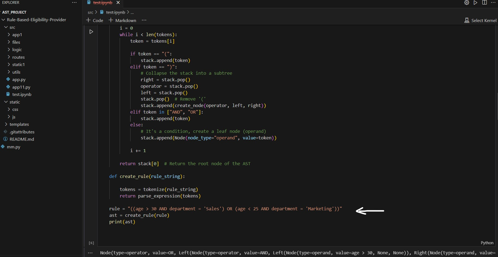

# AST-Based Rule Evaluation System

This project demonstrates how to construct and evaluate abstract syntax trees (AST) to handle complex logical conditions. The application supports combining rules and evaluating them using user data.

## Features

- **AST Construction**: The program builds an AST from a given logical expression that can contain conditions like `(age > 30 AND department = 'Sales') OR (age < 25 AND department = 'Marketing')`.
- **Rule Evaluation**: Using the constructed AST, you can evaluate rules based on different user data.
- **Combining Rules**: You can combine multiple rules using logical operators (e.g., AND, OR) to create more complex conditions.
- **Serialization**: ASTs can be serialized to JSON format and later restored for further processing.
- **Support for Multiple Conditions**: Example conditions include comparisons for age, salary, department, and experience.

## How it Works

### Core Components:

- **Node Class**: Represents the nodes of the AST, where each node can be an operand (condition) or an operator (AND, OR).
- **AST Evaluation**: Functions evaluate the constructed AST based on user data passed to it. Logical operators (AND, OR) are used to combine the results.
- **Tokenization and Parsing**: The application tokenizes and parses the input rule strings to create the AST structure.
- **JSON Support**: You can save and load ASTs in JSON format using the provided utility functions.

### Example Usage

1. **Rule Construction**:
   You can create rules using conditions like age, department, salary, etc., and combine them with AND/OR operations.

   ```python
   rule = "((age > 30 AND department = 'Sales') OR (age < 25 AND department = 'Marketing'))"
   ast = create_rule(rule)
2. **Evaluate Rules**:
   Pass user data to evaluate the rule against the conditions in the AST.
   ```python
   user_data = {
    "age": 35,
    "department": "Sales",
    "salary": 60000,
    "experience": 3
   }
   result = evaluate_ast(ast, user_data)
   print(result)  # Outputs: True or False based on the rule and user data
4. **Combining Rules**:
   You can combine multiple ASTs with logical operators.
   ```python
   combined_ast = combine_rules([ast_1, ast_2], "AND")
   print(evaluate_ast(combined_ast, user_data))
6. **Serialization**:
    Convert the AST to a JSON object for storage or transmission, and restore it later.
   ```python
   ast_json = json.dumps(ast_to_dict(ast))
   restored_ast = dict_to_ast(json.loads(ast_json))
## Setup and Running
1. Clone the repository
   ```bash
   git clone https://github.com/krimerwool/Rule-Based-Eligibility-Provider
   cd Rule-Based-Eligibility-Provider
2. Install Dependencies
   ```bash
   pip install -r requirements.txt
3. Run the Application
   - The frontend is still in progress. In the meantime, you can see the working of the application using the Jupyter Notebook provided in the src folder (test.ipynb).
4. Jupyter Notebook
   - Open the test.ipynb notebook in the src folder to interactively test the AST construction and evaluation process.
   - Follow the Below Screenshot for clarification



   


